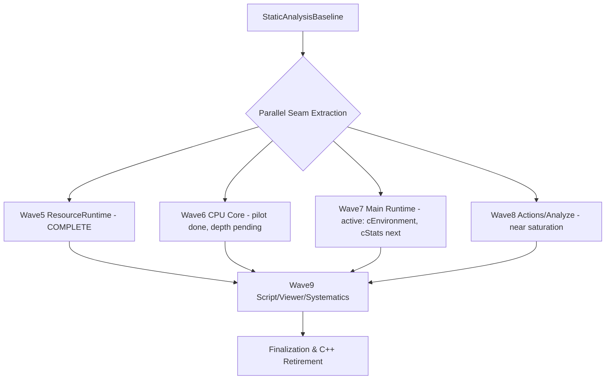

# Full C++ to Rust Migration Plan (Remaining Code)

This is the comprehensive plan for migrating the remaining C++ implementation into Rust while preserving behavior, ABI compatibility, and release safety.

Related baseline: `rust-migration-remaining-cpp-static-analysis.md`

## Objectives

- Complete migration of remaining C++ computational logic to Rust in deterministic, testable slices.
- Keep mixed-language operation throughout migration (no big-bang rewrite).
- Preserve existing public/runtime behavior and serialized output expectations.
- Maintain strict quality gates: build, unit/integration tests, Rust quality/coverage/perf lanes, ABI guardrails.

## Migration Principles

- **Additive seams first**: extract policy/math/selection logic before ownership/lifecycle changes.
- **C ABI stability**: all new Rust entrypoints via additive `avd_*` functions.
- **Parity-first testing**: every slice includes Rust + C++ parity matrix tests.
- **Small reversible slices**: each merge should be independently understandable and releasable.
- **Data-driven prioritization**: rank by remaining LOC, branch complexity, and include-coupling hotspots.

## Deferred Tech-Debt Tranche (Scheduled Later)

These items are tracked as real but non-blocking debt and are intentionally deferred until after the current seam-extraction run:

- Action-kind/routing magic-number cleanup into shared named constants where possible.
- Helper-surface consolidation pass to reduce policy-helper sprawl after current wave throughput.
- Backlog hygiene pass (archive/prune completed entries) to keep next-candidate review concise.
- Follow-on hotspot-depth work in `cHardwareCPU`/`cPopulation` once current deterministic selector slices land.

Execution rule for this tranche:

- Run a dedicated debt-hygiene tranche after every 2-3 completed functional slices, unless a debt item becomes blocking sooner.

## Program Structure

Waves 5–8 execute in parallel by seam-readiness (not sequentially). The critical path is extraction depth in the highest-mass hotspots, not wave ordering.

## Roadmap Waves

## Current Evidence Refresh (2026-03-16)

- Static-analysis refresh run over `avida-core` confirms no drift in planning-scale footprint:
  - C/C++ files: `445`
  - LOC: `173,750`
  - Implementation files: `184` (`132,901` LOC)
  - FFI-touched files: `22`
  - Remaining non-FFI-touched files: `423`
- Hotspot ranking remains stable at the top (`cAnalyze`, `cPopulation`, `cHardwareCPU`) and does not justify a wave reorder.
- Repository and gate evidence confirm `SetGradPlatVarInflow`, `SetPredatoryResource`, `SetProbabilisticResource`, peak getter policy consolidation, shared setter/getter matrix-test consolidation, `cTaskLib` fractional-reward scoring policy extraction, `cTaskLib` registration-family classification policy extraction slices (`logic_3`/`math_1`/`math_2`/`math_3` plus fibonacci/matching/sequence/load-based follow-ons), scoring follow-on threshold/halflife quality policy extraction, unary math per-input diff policy extraction, binary pair diff policy extraction, shared diff-scan reducer policy extraction, `cAnalyze` token-classification seams (relation + output file-type extension + text/html argument tokens + filename-token html classification + file-type token precedence short-circuit combiner + output file-type resolution short-circuit combiner + output sink-selection short-circuit combiner + output file-handle mode short-circuit combiner + output token-presence short-circuit combiner), `cHardwareCPU` dispatch-classification pilot seam (`avd_cpu_dispatch_family` + `avd_cpu_dispatch_counted_opcode`), `PopulationActions` dispatch/validation seams (`avd_popaction_deme_loop_start_index` + `avd_popaction_seed_deme_action` + `avd_popaction_normalize_cell_end` + `avd_popaction_is_valid_cell_range` + `avd_popaction_is_valid_cell_range_with_stride` + `avd_popaction_is_missing_filename_token` + `avd_popaction_is_valid_well_mixed_cell_count` + `avd_popaction_is_valid_group_cell_id` + `avd_popaction_is_valid_single_cell_id` + `avd_popaction_should_skip_parasite_injection` + `avd_popaction_is_missing_parasite_filename_token` + `avd_popaction_has_missing_parasite_pair_filenames` + `avd_popaction_is_missing_parasite_label_token` + `avd_popaction_is_missing_parasite_sequence_token` + `avd_popaction_parasite_invalid_range_warning_kind` + `avd_popaction_parasite_warning_short_circuit_kind` + `avd_popaction_parasite_missing_token_short_circuit_kind` + `avd_popaction_parasite_missing_token_error_kind`), `PrintActions` instruction selection seams (`avd_printaction_instruction_filename_mode` pilot + action-chain expansion + `avd_printaction_instruction_output_sink_kind` short-circuit follow-on), and `cPopulation` deme-routing seams (`avd_cpop_should_check_implicit_deme_repro` + `avd_cpop_should_run_speculative_deme_block` + `avd_cpop_deme_routing_short_circuit_kind` + `avd_cpop_should_update_deme_counters` + `avd_cpop_should_run_multi_deme_block`) are implemented and validated through the full mandatory gate set in this branch state.
- Performance-first characterization pass completed and captured in `documentation/performance-hotspot-baseline-2026-03-16.md`, including call-frequency hotspot ranking, focused hotspot analysis, and executable benchmark harness update (`resource_update_dispatch_helpers/mixed_geometry_dispatch_pipeline`).

## Wave 5 Status: COMPLETE

All `cResourceCount`/`cSpatialResCount` deterministic helper seams extracted (42 call-sites, 35+ FFI exports). Resource runtime C++ is now orchestration-only. Wave 5 slice history archived in `documentation/archive/rust-migration-waves-completed.md`.

## Active Extraction Front (Waves 6–8 parallel)

Current focus: pivot from near-saturated action/analyze targets to fresh untouched hotspots.

- **Immediate next**: `cEnvironment.cc` reaction-process-type classification (Wave 7, fresh target)
- **Then**: `cStats.cc` task-count filtering / resource-gradient classification (Wave 7, fresh target)
- **Continuing**: `cHardwareCPU.cc` depth extraction (Wave 6), `cPopulation.cc` decision-surface expansion (Wave 7)
- **Maintenance**: `PopulationActions`/`PrintActions`/`cAnalyze` follow-ons only if new seam-ready patterns emerge

Exit criteria per slice:

- Existing full gates all pass.
- No regressions in `run_tests --mode=slave`.
- ABI additive-only changes.
- Slice is only recorded as completed in roadmap/backlog after gate evidence is captured and the change set is ready to commit.

## Wave 6: CPU execution core

Top targets (hotspots):

- `source/cpu/cHardwareCPU.cc`
- `source/cpu/cHardwareExperimental.cc`
- `source/cpu/cHardwareBCR.cc`
- `source/cpu/cHardwareGP8.cc`

Approach:

- Phase 6A: extract deterministic opcode dispatch/classification helpers.
- Phase 6B: extract arithmetic/stack/indexing micro-kernels.
- Phase 6C: extract mutation/flow control policies with parity fixtures.

Exit criteria:

- Per-hardware parity fixtures stable and deterministic.
- Perf lane confirms no large regressions in critical op paths.

## Wave 7: Main runtime core

Top targets:

- `source/main/cPopulation.cc`
- `source/main/cTaskLib.cc`
- `source/main/cStats.cc`
- `source/main/cEnvironment.cc`
- `source/main/cPhenotype.cc`

Approach:

- Prioritize pure decision policies and deterministic state transitions.
- Keep object graph ownership in C++ until final stage.

Exit criteria:

- Behavior-equivalent outputs for existing integration suites.
- Resource/population/task deterministic parity maintained.

## Wave 8: Actions + analyze pipelines

Top targets:

- `source/analyze/cAnalyze.cc`
- `source/actions/PopulationActions.cc`
- `source/actions/PrintActions.cc`

Approach:

- Extract parser/selector/aggregation logic first.
- Preserve I/O and command plumbing in C++ until late-stage.

Exit criteria:

- Analyze/action golden outputs unchanged (except explicitly approved updates).

## Wave 9: Script/viewer/systematics tail

Targets:

- `source/script/*`
- `source/viewer/*`
- `source/systematics/*`
- selected `source/targets/*` non-test runtime glue

Approach:

- Migrate computational cores; keep platform-specific glue thin.
- Retain low-risk C++ wrappers where Rust adds no clear value.

Exit criteria:

- Remaining C++ is limited to minimal platform wrappers and compatibility shims.

## Finalization: C++ retirement and consolidation

- Remove obsolete C++ implementations after parity confidence and soak period.
- Collapse duplicated policy constants and wrappers.
- Keep a final ABI baseline snapshot and migration completion report.

## Sequencing and Cadence

- Slice cadence: 1-3 slices per week depending on hotspot complexity.
- Every slice includes:
  - ABI additions
  - Rust implementation + tests
  - C++ call-site routing
  - C++ parity tests
  - docs/backlog/waves refresh

## Updated Priority Order (Top 5, 2026-03-17)

1. **`cEnvironment.cc` reaction/process type dispatch classifiers** — fresh target, 0 avd_ calls, classic string→enum patterns, very seam-ready, low risk.
2. **`cStats.cc` task-count filtering and resource-gradient classification** — fresh target, 0 avd_ calls, pure aggregation/filtering patterns.
3. **`cHardwareCPU.cc` instruction precondition and thread-evolution helpers** — only 2 avd_ calls in 11K LOC, massive remaining surface, moderate risk.
4. **`cPopulation.cc` opinion/group assignment and forager classification** — 7 avd_ calls in 9.5K LOC, large decision surface still untouched.
5. **`cTaskLib.cc` remaining name-dispatch and span/fibonacci scoring** — 39 avd_ calls, diminishing returns but some remaining scoring patterns.

## Risk Register (Program-level)

- **Behavior drift in high-complexity hotspots**: mitigate with matrix parity + fixture replay.
- **Cross-language ownership bugs**: mitigate via opaque handles and C++ ownership retention.
- **Perf regressions**: mitigate via `perf-rust` lane and targeted microbenchmarks.
- **Scope sprawl**: mitigate by strict additive-slice boundaries and per-slice exit criteria.

## Success Metrics

- Remaining C++ code LOC trend (from baseline doc) declines wave-over-wave.
- FFI-touched file count increases with validated parity.
- Hotspot files (`cAnalyze`, `cPopulation`, CPU hardware cores) progressively reduced/replaced.
- CI pass rate remains stable while migration velocity continues.
